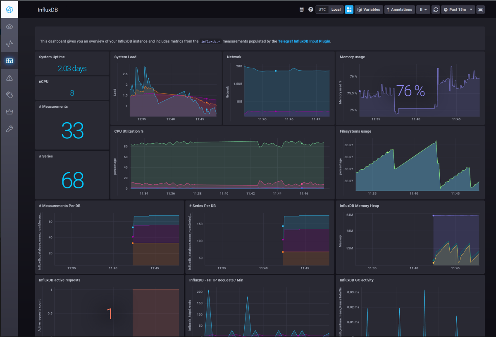
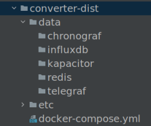

# URL Converter

## Java Service converting long URLs into short one and back to long one.
 
#### Project built with Java 11, it is using Redis DB as a persistence storage.

Converter utilizes Base 10 to Base 62 conversion technique to produce short URL and convert them back into long URL one.

General assumption here is that user can send long url with proposed short url or without it.
_/url-converter-named/_ endponits deal with first case while _/url-converter/_ with the second one respectively. 
When user send conversion request without care about the result, it's original url used to send request is used
as the base to create shot url.
Whatever the way chosen there are two separate endpoints for each method for json and plain text inputs.

### Endpoints

#### Convert long URL into the short one
Service exposes 4 endpoints for user convenience:

*  __/url-converter/add__ - accepts application/json payload
*  __/url-converter/add-plain-text__ - accepts plain text payload

Both endpoints require json payload of the following format:
    
    {"url": "https://www.llanfairpwllgwyngyllgogerychwyrndrobwllllantysiliogogogochuchaf.eu"}

*  __/url-converter-named/add__ - accepts application/json payload
*  __/url-converter-named/add-plain-text__ - accepts plain text payload

Both endpoints require json payload of the following format:
    
    {"shortUrl": "https://www.my.short.url", "longUrl": {"url": "https://www.llanfairpwllgwyngyllgogerychwyrndrobwllllantysiliogogogochuchaf.eu"}

Long URLs need to be valid syntactically URLs, following examples fail when sent:
    
    "httttps://www.my.short.url"
    "https://wwwmyshorturl"

#### Convert short URL back into the long one
Service exposes 4 endpoints corresponding to the conversion method used :

* __/url-converter/get/{id}__
* __/url-converter-named/get/{id}__

Both requests find long URLs in the database and return them. 

*  __/url-converter/get/{id}__
* __/url-converter-named/get/{id}__

Both methods obtain long URL with generated short ID which the last section of short URL (everything after last slash).
However those methods expect a special header named 'short-url' containing short URL generated before to do conversion back.
Methods return error if header is missing.

### Project Structure
Source code is a regular Spring application and is organized accordingly:
- **controller** contains rest controllers serving above endpoints 
- **model** contains payload classes for all endpoints   
- **repository** contains db level code responsible for redis interactions
- **service** contains URL conversion service class responsible for encoding and decoding URLs
- **util** contains Base62 encoder and URL validator

**application.properties** file is the only resource used. It holds Influx DB connections details required by the service monitor.
    
#### Building

Since whole projects sits in docker containers there is noting to build here. Deployment steps are explained below.
    
#### Testing

There are 2 python scripts in /scripts folder helping with this. 
Their names suggest the purpose but Python interpreter is required to run them. 
More about this can be found below either.

### Service Monitor

Monitoring and statistics gathering is resolved with TICK stack.
Service sends its measurements to time series database, which TICK stack picks for further analysis.   

##### TICK Stack

The TICK Stack is an acronym for a platform of open source tools built to make operations on time series data incredibly easy.
- “T” stands for Telegraf. It's a metrics collection agent. Use it to collect and send metrics to InfluxDB.
- “I” stands for InfluxDB. It is the database holding all measurement data. It is also the only point connecting Service with Monitor.
- “C” stands for Chronograf. It is the UI layer of whole TICK stack.
- “K” stands for Kapacitor. It is metrics and events processing and alerting engine. It crunches time series data into callable alerts.

It has pretty nifty interface and provides all tools necessary for application surveillance.

  

### Deployment

Whole stack can be deployed as single docker container.
Project has folder **converter-dist** which contain all the files required by the monitor deployment.
However due to git restrictions contents of this folder are added to properly, GitHub does not contain everything as it supposed to.
Correct folder content looks like this:

All missing folder should added manually bore running docker commands.

following commands pulls all required components and creates the environment:
- docker pull influxdb
- docker pull telegraf
- docker pull kapacitor
- docker pull quay.io/influxdb/chronograf
- docker pull redis
- docker pull smoczyna/url-converter

finally _docker-compose up_ executed from converter-dist folder does all the tricks to put everything together

**docker-compose** also can pull images, following sequence does the same job:

cd converter-dist
- docker-compose pull influxdb
- docker-compose pull telegraf
- docker-compose pull kapacitor
- docker-compose pull chronograf
- docker-compose pull redis
- docker-compose pull url-converter
- docker-compose up

You may need 'sudo' to do all of that. 

Most important thing here is that all ports listed below have to open, otherwise converter fails to start:

- 6379
- 8080
- 8086
- 8125
- 8092
- 8094
- 8888
- 9092

  
        Monitoring and Statistics Gathering : this still needs to be updated, I didn't do much about that as it is not the priority.
        Chronograf allows to configure any type of measurements and visualize them however it needs queries to do it.
        Some basic scripts can be found in scripts folder but chronograf dashboard need to be created manually using UI. 
        Python scripts making converter busy for a while may help here, they are also available in scripts folder.

### Know issues and limitations

Converter relies on Base62 to Base10 conversion and vice versa. I have tried 2 different algorithms, they are fast and reliable but both have the limitation too.
The highest convertible Long number is 999999999999999, bigger numbers might cause the conversion results not to match.
So it seems that overall number of request per URL (proposed short or default) is that high.
There isn't any feature checking if that happens. However, I couldn't reach that limit on my home machine(s) to verify that as it takes too long. 

Redis connection is synchronized (all its save methods) so huge number of parallel calls make cause a bottleneck here, it's worth checking. 

        The last but not least thing is redis connection, it's host name is hardcoded to be usable in docker
        If service is abou to be run on local machine, 'redis' string parameter need to be removed from line 27 of UriRepo class:
        this.jedis = new Jedis("redis"); - that's the line

---

### Reference Documentation
For further reference, please consider the following sections:

* [Official Apache Maven documentation](https://maven.apache.org/guides/index.html)
* [Spring Data Redis (Access+Driver)](https://docs.spring.io/spring-boot/docs/2.4.0/reference/htmlsingle/#boot-features-redis)
* [TICK Stack introduction](https://www.influxdata.com/blog/introduction-to-influxdatas-influxdb-and-tick-stack/)
* [Influx API Reference](https://docs.influxdata.com/influxdb/v1.8/tools/api/)
* [Kapacitor API Reference](https://docs.influxdata.com/kapacitor/v1.5/working/cli_client/)
* [Docker Compose Reference](https://docs.docker.com/compose/reference/pull/)

### Guides
Following guides illustrate problems I had to deal with specifically:

* [Base62 conversion explained](https://dzone.com/articles/url-shortener-detailed-explanation)
* [How to send URL as path variable](https://stackoverflow.com/questions/57212145/how-to-pass-url-as-path-variable)
* [Messaging with Redis](https://spring.io/guides/gs/messaging-redis/)

