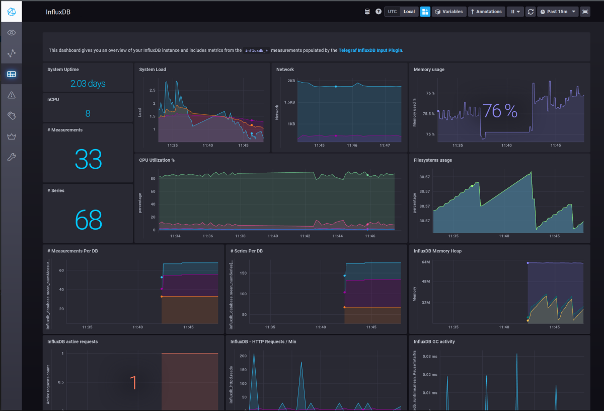

# URL Converter

## Java Service converting long URLs into short once and back.
 
#### Project built with Java 11, it is using Redis DB as a persistence storage.

Converter utilizes Base 10 to Base 62 conversion technique to produce short URL and convert them back into long URL one.

General assumption here is that user can send long url with proposed short url or without it.
_/url-converter-named/_ endponits deal with first case while _/url-converter/_ with the second one respectively. 
When user send conversion request without care about the result, it's original url used to send request is used
as the base to create shot url.
Whatever the way chosen there are two separate endpoints for each method for json and plain text inputs.

### Endpoints

#### Convert long URL into the short one
Service exposes 4 endpoints for user convenience:

*  __/url-converter/add__ - accepts application/json payload
*  __/url-converter/add-plain-text__ - accepts plain text payload

Both endpoints require json payload of the following format:
    
    {"url": "https://www.llanfairpwllgwyngyllgogerychwyrndrobwllllantysiliogogogochuchaf.eu"}

*  __/url-converter-named/add__ - accepts application/json payload
*  __/url-converter-named/add-plain-text__ - accepts plain text payload

Both endpoints require json payload of the following format:
    
    {"shortUrl": "https://www.my.short.url", "longUrl": {"url": "https://www.llanfairpwllgwyngyllgogerychwyrndrobwllllantysiliogogogochuchaf.eu"}

Long URLs need to be valid syntactically URLs, following examples fail when sent:
    
    "httttps://www.my.short.url"
    "https://wwwmyshorturl"

#### Convert short URL back into the long one
Service exposes 4 endpoints corresponding to the conversion method used :

* __/url-converter/get/{id}__
* __/url-converter-named/get/{id}__

Both requests find long URLs in the database and return them. 

*  __/url-converter/get/{id}__
* __/url-converter-named/get/{id}__

Both methods obtain long URL with generated short ID which the last section of short URL (everything after last slash).

### Project Structure
Source code is a regular Spring application and is organized accordingly:
- **controller** contains rest controllers serving above endpoints 
- **model** contains payload classes for all endpoints   
- **repository** contains db level code responsible for redis interactions
- **service** contains URL conversion service class responsible for encoding and decoding URLs
- **util** contains Base62 encoder and URL validator

**application.properties** file is the only resource used. It holds Influx DB connections details required by the service monitor.
    
    Building and Testing : there will be more about that a bit later, it's contenerization is not reeady yet.
    For now project can be built and run as regular Spring Boot Application from pretty much any IDE.
    Monitor is already in docker contaners and its setup is independent. Next section explains hot to deploy it.

### Service Monitor

Monitoring and statistics gathering is resolved with TICK stack.
Service sends its measurements to time series database, which TICK stack picks for further analysis.   

##### TICK Stack

The TICK Stack is an acronym for a platform of open source tools built to make operations on time series data incredibly easy.
- “T” stands for Telegraf. It's a metrics collection agent. Use it to collect and send metrics to InfluxDB.
- “I” stands for InfluxDB. It is the database holding all measurement data. It is also the only point connecting Service with Monitor.
- “C” stands for Chronograf. It is the UI layer of whole TICK stack.
- “K” stands for Kapacitor. It is metrics and events processing and alerting engine. It crunches time series data into callable alerts.

It has pretty nifty interface and provides all tools necessary for application surveillance.

  

Whole stack can be deployed as single docker container.
Project has folder **monitor** which contain all the files required by the monitor deployment.

following commands pulls all required components and creates the environment:
- docker pull influxdb
- docker pull telegraf
- docker pull kapacitor
- docker pull quay.io/influxdb/chronograf
- finally _docker-compose up_ executed from monitor folder does all the tricks to put everything together

docker-compose also can pull images, following sequence does the same job:

- docker-compose pull influxdb
- docker-compose pull telegraf
- docker-compose pull kapacitor
- docker-compose pull quay.io/influxdb/chronograf:1.8.8
- docker-compose up
    

    Monitoring and Statistics Gathering : there will be more about that later too, I didn't much about that as it is nt the priority.
    Chronograf allows to configure any type of measurements and visualize them however it needs queries to do it.
    Up to now all stress and performance tests can be run by python attached scripts, available in scripts folder.

---

### Reference Documentation
For further reference, please consider the following sections:

* [Official Apache Maven documentation](https://maven.apache.org/guides/index.html)
* [Spring Boot Maven Plugin Reference Guide](https://docs.spring.io/spring-boot/docs/2.4.0/maven-plugin/reference/html/)
* [Spring Data Redis (Access+Driver)](https://docs.spring.io/spring-boot/docs/2.4.0/reference/htmlsingle/#boot-features-redis)
* [Create an OCI image](https://docs.spring.io/spring-boot/docs/2.4.0/maven-plugin/reference/html/#build-image)
* [TICK Stack introduction](https://www.influxdata.com/blog/introduction-to-influxdatas-influxdb-and-tick-stack/)
* [Influx API Reference](https://docs.influxdata.com/influxdb/v1.8/tools/api/)
* [Kapacitor API Reference](https://docs.influxdata.com/kapacitor/v1.5/working/cli_client/)

### Guides
Following guides illustrate how to use some features specifically:

* [Base62 conversion explained](https://dzone.com/articles/url-shortener-detailed-explanation)
* [How to send URL as path variable](https://stackoverflow.com/questions/57212145/how-to-pass-url-as-path-variable)
* [Messaging with Redis](https://spring.io/guides/gs/messaging-redis/)
* [Docker Compose Reference](https://docs.docker.com/compose/reference/pull/)

